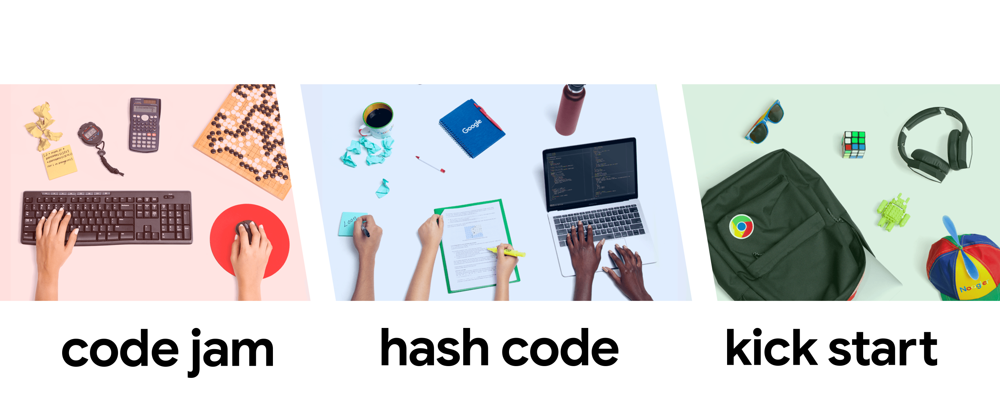

# Google's Coding Competitions

Solutions to some of the questions from coding competitions by [Google](https://codingcompetitions.withgoogle.com/ "Google's Coding Competitions").

## Code Jam

| Problem Solution										| Problem Statement 						| Round 				| Year	|
|:-----------------------------------------------------:|-------------------------------------------|:---------------------:|:-----:|
| [A.cpp](Code%20Jam/2020/Qualification%20Round/A.cpp)	| [Vestigium]								| Qualification Round	| 2020	|
| [B.cpp](Code%20Jam/2020/Qualification%20Round/B.cpp)	| [Nesting Depth]							| Qualification Round	| 2020	|
| [C.cpp](Code%20Jam/2020/Qualification%20Round/C.cpp)	| [Parenting Partnering Returns]			| Qualification Round	| 2020	|
| [D.cpp](Code%20Jam/2020/Qualification%20Round/D.cpp)	| [ESAb ATAd]								| Qualification Round	| 2020	|
| [A.cpp](Code%20Jam/2020/Round%201A/A.cpp)				| [Pattern Matching]						| Round 1A				| 2020	|
| [B.cpp](Code%20Jam/2020/Round%201A/B.cpp)				| [Pascal Walk]								| Round 1A				| 2020	|
| [C.cpp](Code%20Jam/2020/Round%201A/C.cpp)				| [Square Dance]							| Round 1A				| 2020	|
| [B.cpp](Code%20Jam/2017/Qualification%20Round/B.cpp)	| [Tidy Numbers]							| Qualification Round	| 2017	|
| [A.cpp](Code%20Jam/2017/Round%201A/A.cpp)				| [Alphabet Cake]							| Round 1A				| 2017	|

## Kick Start

| Problem Solution								| Problem Statement 		| Round 	| Year	|
|:---------------------------------------------:|---------------------------|:---------:|:-----:|
| [A.cpp](Kick%20Start/2020/Round%20A/A.cpp)	| [Allocation]				| Round A	| 2020	|
| [B.cpp](Kick%20Start/2020/Round%20A/B.cpp)	| [Plates]					| Round A	| 2020	|
| [C.cpp](Kick%20Start/2020/Round%20A/C.cpp)	| [Workout]					| Round A	| 2020	|
| [D.cpp](Kick%20Start/2020/Round%20A/D.cpp)	| [Bundling]				| Round A	| 2020	|
| [A.cpp](Kick%20Start/2020/Round%20B/A.cpp)	| [Bike Tour]				| Round B	| 2020	|
| [B.cpp](Kick%20Start/2020/Round%20B/B.cpp)	| [Bus Routes]				| Round B	| 2020	|
| [C.cpp](Kick%20Start/2020/Round%20B/C.cpp)	| [Robot Path Decoding]		| Round B	| 2020	|
| [D.cpp](Kick%20Start/2020/Round%20B/D.cpp)	| [Wandering Robot]			| Round B	| 2020	|

[//]: # (Code Jam)

[Vestigium]: https://codingcompetitions.withgoogle.com/codejam/round/000000000019fd27/000000000020993c
[Nesting Depth]: https://codingcompetitions.withgoogle.com/codejam/round/000000000019fd27/0000000000209a9f
[Parenting Partnering Returns]: https://codingcompetitions.withgoogle.com/codejam/round/000000000019fd27/000000000020bdf9
[ESAb ATAd]: https://codingcompetitions.withgoogle.com/codejam/round/000000000019fd27/0000000000209a9e
[Pattern Matching]: https://codingcompetitions.withgoogle.com/codejam/round/000000000019fd74/00000000002b3034
[Pascal Walk]: https://codingcompetitions.withgoogle.com/codejam/round/000000000019fd74/00000000002b1353
[Square Dance]: https://codingcompetitions.withgoogle.com/codejam/round/000000000019fd74/00000000002b1355

[Tidy Numbers]: https://code.google.com/codejam/contest/3264486/dashboard#s=p1
[Alphabet Cake]: https://code.google.com/codejam/contest/5304486/dashboard#s=p0

[//]: # (Hash Code)

[//]: # (Kick Start)

[Allocation]: https://codingcompetitions.withgoogle.com/kickstart/round/000000000019ffc7/00000000001d3f56
[Plates]: https://codingcompetitions.withgoogle.com/kickstart/round/000000000019ffc7/00000000001d40bb
[Workout]: https://codingcompetitions.withgoogle.com/kickstart/round/000000000019ffc7/00000000001d3f5b
[Bundling]: https://codingcompetitions.withgoogle.com/kickstart/round/000000000019ffc7/00000000001d3ff3

[Bike Tour]: https://codingcompetitions.withgoogle.com/kickstart/round/000000000019ffc8/00000000002d82e6
[Bus Routes]: https://codingcompetitions.withgoogle.com/kickstart/round/000000000019ffc8/00000000002d83bf
[Robot Path Decoding]: https://codingcompetitions.withgoogle.com/kickstart/round/000000000019ffc8/00000000002d83dc
[Wandering Robot]: https://codingcompetitions.withgoogle.com/kickstart/round/000000000019ffc8/00000000002d8565

[//]: # (EOF)