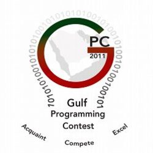

# Gulf Programming Contest

Solutions to some of the contest problems on the Gulf Programming Contest [website](http://www.gulfpc.org "GPC").

This repository aims to provide solutions to problem sets of previous years.

## 2015

| Problem Statement                      | Solution          | Input File       | Output File       |
|----------------------------------------|:-----------------:|:----------------:|:-----------------:|
| [A. Predictive Text Input]             | [predict.cpp]     | [predict.in]     | [predict.out]     |
| [B. The League]                        | [league.cpp]      | [league.in]      | [league.out]      |
| [C. Exam Graph]                        | [graph.cpp]       | [graph.in]       | [graph.out]       |
| [D. Pisano Periods]                    | [pisano.cpp]      | [pisano.in]      | [pisano.out]      |
| [I. Antibiotics]                       | [antibiotics.cpp] | [antibiotics.in] | [antibiotics.out] |
| [J. Dance (a.k.a The Circles of Evil)] | [dance.cpp]       | [dance.in]       | [dance.out]       |

## 2016

| Problem Statement                           | Solution       | Input File    | Output File    |
|---------------------------------------------|:--------------:|:-------------:|:--------------:|
| [A. Ntonic Sequence]                        | [sequence.cpp] | [sequence.in] | [sequence.out] |
| [B. If It’s Meant To Be, You Will Guess It] | [guess.cpp]    | [guess.in]    | [guess.out]    |
| [D. The Big Sorter]                         | [sorter.cpp]   | [sorter.in]   | [sorter.out]   |
| [I. Largest Number]                         | [largest.cpp]  | [largest.in]  | [largest.out]  |
| [J. Pedestrian Bridges]                     | [bridges.cpp]  | [bridges.in]  | [bridges.out]  |
| [K. Leap]                                   | [leap.cpp]     | [leap.in]     | [leap.out]     |

## 2017

| Problem Statement       | Solution                             | Input File                         | Output File                          |
|-------------------------|:------------------------------------:|:----------------------------------:|:------------------------------------:|
| [A. Squares or Circles] | [squares.cpp]                        | [squares.in]                       | [squares.out]                        |
| [B. The Peak Hour]      | [peak.cpp]                           | [peak.in]                          | [peak.out]                           |
| [C. Table Sorting]      | [sorting.cpp]                        | [sorting.in]                       | [sorting.out]                        |
| [D. The Easy League]    | [league.cpp](2017/league/league.cpp) | [league.in](2017/league/league.in) | [league.out](2017/league/league.out) |
| [F. Sales Craze]        | [sales.cpp]                          | [sales.in]                         | [sales.out]                          |
| [H. Armstrong numbers]  | [armstrong.cpp]                      | [armstrong.in]                     | [armstrong.out]                      |
| [I. Amicable Numbers]   | [amicable.cpp]                       | [amicable.in]                      | [amicable.out]                       |
| [J. Number Pyramid]     | [pyramid.cpp]                        | [pyramid.in]                       | [pyramid.out]                        |
| [L. The Digits]         | [digits.cpp]                         | [digits.in]                        | [digits.out]                         |

## 2018

| Problem Statement                | Solution       | Input File    | Output File    |
|----------------------------------|:--------------:|:-------------:|:--------------:|
| [A. Rocket Fuel]                 | [rocket.cpp]   | [rocket.in]   | [rocket.out]   |
| [B. Socks of The Dark]           | [socks.cpp]    | [socks.in]    | [socks.out]    |
| [C. Squaring the Sequence]       | [square.cpp]   | [square.in]   | [square.out]   |
| [F. Inherited Land]              | [land.cpp]     | [land.in]     | [land.out]     |
| [H. Rotating keyboard]           | [keyboard.cpp] | [keyboard.in] | [keyboard.out] |
| [I. Fermat’s Triangular Numbers] | [tri.cpp]      | [tri.in]      | [tri.out]      |
| [J. Flight Duration]             | [flight.cpp]   | [flight.in]   | [flight.out]   |
| [K. The Gabriel Graph]           | [gabriel.cpp]  | [gabriel.in]  | [gabriel.out]  |

## 2019

| Problem Statement          | Solution         | Input File      | Output File      |
|----------------------------|:----------------:|:---------------:|:----------------:|
| [A. The Purifier]          | [purifier.cpp]   | [purifier.in]   | [purifier.out]   |
| [B. n Base Palindrome]     | [palindrome.cpp] | [palindrome.in] | [palindrome.out] |
| [C. Miles of The Sky]      | [miles.cpp]      | [miles.in]      | [miles.out]      |
| [D. Take that Photo]       | [photo.cpp]      | [photo.in]      | [photo.out]      |
| [E. Fair share]            | [fair.cpp]       | [fair.in]       | [fair.out]       |
| [F. Fruit burst]           | [fruit.cpp]      | [fruit.in]      | [fruit.out]      |
| [H. Dice of Probability]   | [dice.cpp]       | [dice.in]       | [dice.out]       |
| [I. The Secret Message]    | [secret.cpp]     | [secret.in]     | [secret.out]     |
| [J. The Legend of Diapers] | [diapers.cpp]    | [diapers.in]    | [diapers.out]    |
| [K. Pyramids]              | [pyramids.py]    | [pyramids.in]   | [pyramids.out]   |
| [L. Table Format]          | [table.cpp]      | [table.in]      | [table.out]      |

[//]: # (2015)

[A. Predictive Text Input]: 2015/predict/Predictive%20Text%20Input.pdf
[predict.cpp]: 2015/predict/predict.cpp?ts=4
[predict.in]: 2015/predict/predict.in
[predict.out]: 2015/predict/predict.out

[B. The League]: 2015/league/The%20League.pdf
[league.cpp]: 2015/league/league.cpp?ts=4
[league.in]: 2015/league/league.in
[league.out]: 2015/league/league.out

[C. Exam Graph]: 2015/graph/Exam%20Graph.pdf
[graph.cpp]: 2015/graph/graph.cpp?ts=4
[graph.in]: 2015/graph/graph.in
[graph.out]: 2015/graph/graph.out

[D. Pisano Periods]: 2015/pisano/Pisano%20Periods.pdf
[pisano.cpp]: 2015/pisano/pisano.cpp?ts=4
[pisano.in]: 2015/pisano/pisano.in
[pisano.out]: 2015/pisano/pisano.out

[I. Antibiotics]: 2015/antibiotics/Antibiotics.pdf
[antibiotics.cpp]: 2015/antibiotics/antibiotics.cpp?ts=4
[antibiotics.in]: 2015/antibiotics/antibiotics.in
[antibiotics.out]: 2015/antibiotics/antibiotics.out

[J. Dance (a.k.a The Circles of Evil)]: 2015/dance/Dance%20(a.k.a%20The%20Circles%20of%20Evil).pdf
[dance.cpp]: 2015/dance/dance.cpp?ts=4
[dance.in]: 2015/dance/dance.in
[dance.out]: 2015/dance/dance.out

[//]: # (2016)

[A. Ntonic Sequence]: 2016/sequence/Ntonic%20Sequence.pdf
[sequence.cpp]: 2016/sequence/sequence.cpp?ts=4
[sequence.in]: 2016/sequence/sequence.in
[sequence.out]: 2016/sequence/sequence.out

[B. If It’s Meant To Be, You Will Guess It]: 2016/guess/If%20It’s%20Meant%20To%20Be,%20You%20Will%20Guess%20It.pdf
[guess.cpp]: 2016/guess/guess.cpp?ts=4
[guess.in]: 2016/guess/guess.in
[guess.out]: 2016/guess/guess.out

[D. The Big Sorter]: 2016/sorter/The%20Big%20Sorter.pdf
[sorter.cpp]: 2016/sorter/sorter.cpp?ts=4
[sorter.in]: 2016/sorter/sorter.in
[sorter.out]: 2016/sorter/sorter.out

[I. Largest Number]: 2016/largest/Largest%20Number.pdf
[largest.cpp]: 2016/largest/largest.cpp?ts=4
[largest.in]: 2016/largest/largest.in
[largest.out]: 2016/largest/largest.out

[J. Pedestrian Bridges]: 2016/bridges/Pedestrian%20Bridges.pdf
[bridges.cpp]: 2016/bridges/bridges.cpp?ts=4
[bridges.in]: 2016/bridges/bridges.in
[bridges.out]: 2016/bridges/bridges.out

[K. Leap]: 2016/leap/Leap.pdf
[leap.cpp]: 2016/leap/leap.cpp?ts=4
[leap.in]: 2016/leap/leap.in
[leap.out]: 2016/leap/leap.out

[//]: # (2017)

[A. Squares or Circles]: 2017/squares/Squares%20or%20Circles.pdf
[squares.cpp]: 2017/squares/squares.cpp?ts=4
[squares.in]: 2017/squares/squares.in
[squares.out]: 2017/squares/squares.out

[B. The Peak Hour]: 2017/peak/The%20Peak%20Hour.pdf
[peak.cpp]: 2017/peak/peak.cpp?ts=4
[peak.in]: 2017/peak/peak.in
[peak.out]: 2017/peak/peak.out

[C. Table Sorting]: 2017/sorting/Table%20Sorting.pdf
[sorting.cpp]: 2017/sorting/sorting.cpp?ts=4
[sorting.in]: 2017/sorting/sorting.in
[sorting.out]: 2017/sorting/sorting.out

[D. The Easy League]: 2017/league/The%20Easy%20League.pdf

[F. Sales Craze]: 2017/sales/Sales%20Craze.pdf
[sales.cpp]: 2017/sales/sales.cpp?ts=4
[sales.in]: 2017/sales/sales.in
[sales.out]: 2017/sales/sales.out

[H. Armstrong numbers]: 2017/armstrong/Armstrong%20numbers.pdf
[armstrong.cpp]: 2017/armstrong/armstrong.cpp?ts=4
[armstrong.in]: 2017/armstrong/armstrong.in
[armstrong.out]: 2017/armstrong/armstrong.out

[I. Amicable Numbers]: 2017/amicable/Amicable%20Numbers.pdf
[amicable.cpp]: 2017/amicable/amicable.cpp?ts=4
[amicable.in]: 2017/amicable/amicable.in
[amicable.out]: 2017/amicable/amicable.out

[J. Number Pyramid]: 2017/pyramid/Number%20Pyramid.pdf
[pyramid.cpp]: 2017/pyramid/pyramid.cpp?ts=4
[pyramid.in]: 2017/pyramid/pyramid.in
[pyramid.out]: 2017/pyramid/pyramid.out

[L. The Digits]: 2017/digits/The%20Digits.pdf
[digits.cpp]: 2017/digits/digits.cpp?ts=4
[digits.in]: 2017/digits/digits.in
[digits.out]: 2017/digits/digits.out

[//]: # (2018)

[A. Rocket Fuel]: 2018/rocket/Rocket%20Fuel.pdf
[rocket.cpp]: 2018/rocket/rocket.cpp?ts=4
[rocket.in]: 2018/rocket/rocket.in
[rocket.out]: 2018/rocket/rocket.out

[B. Socks of The Dark]: 2018/socks/Socks%20of%20The%20Dark.pdf
[socks.cpp]: 2018/socks/socks.cpp?ts=4
[socks.in]: 2018/socks/socks.in
[socks.out]: 2018/socks/socks.out

[C. Squaring the Sequence]: 2018/square/Squaring%20the%20Sequence.pdf
[square.cpp]: 2018/square/square.cpp?ts=4
[square.in]: 2018/square/square.in
[square.out]: 2018/square/square.out

[F. Inherited Land]: 2018/land/Inherited%20Land.pdf
[land.cpp]: 2018/land/land.cpp?ts=4
[land.in]: 2018/land/land.in
[land.out]: 2018/land/land.out

[H. Rotating keyboard]: 2018/keyboard/Rotating%20keyboard.pdf
[keyboard.cpp]: 2018/keyboard/keyboard.cpp?ts=4
[keyboard.in]: 2018/keyboard/keyboard.in
[keyboard.out]: 2018/keyboard/keyboard.out

[I. Fermat’s Triangular Numbers]: 2018/tri/Fermat’s%20Triangular%20Numbers.pdf
[tri.cpp]: 2018/tri/tri.cpp?ts=4
[tri.in]: 2018/tri/tri.in
[tri.out]: 2018/tri/tri.out

[J. Flight Duration]: 2018/flight/Flight%20Duration.pdf
[flight.cpp]: 2018/flight/flight.cpp?ts=4
[flight.in]: 2018/flight/flight.in
[flight.out]: 2018/flight/flight.out

[K. The Gabriel Graph]: 2018/gabriel/The%20Gabriel%20Graph.pdf
[gabriel.cpp]: 2018/gabriel/gabriel.cpp?ts=4
[gabriel.in]: 2018/gabriel/gabriel.in
[gabriel.out]: 2018/gabriel/gabriel.out

[//]: # (2019)

[A. The Purifier]: 2019/purifier/The%20Purifier.pdf
[purifier.cpp]: 2019/purifier/purifier.cpp?ts=4
[purifier.in]: 2019/purifier/purifier.in
[purifier.out]: 2019/purifier/purifier.out

[B. n Base Palindrome]: 2019/palindrome/n%20Base%20Palindrome.pdf
[palindrome.cpp]: 2019/palindrome/palindrome.cpp?ts=4
[palindrome.in]: 2019/palindrome/palindrome.in
[palindrome.out]: 2019/palindrome/palindrome.out

[C. Miles of The Sky]: 2019/miles/Miles%20of%20The%20Sky.pdf
[miles.cpp]: 2019/miles/miles.cpp?ts=4
[miles.in]: 2019/miles/miles.in
[miles.out]: 2019/miles/miles.out

[D. Take that Photo]: 2019/photo/Take%20that%20Photo.pdf
[photo.cpp]: 2019/photo/photo.cpp?ts=4
[photo.in]: 2019/photo/photo.in
[photo.out]: 2019/photo/photo.out

[E. Fair share]: 2019/fair/Fair%20share.pdf
[fair.cpp]: 2019/fair/fair.cpp?ts=4
[fair.in]: 2019/fair/fair.in
[fair.out]: 2019/fair/fair.out

[F. Fruit burst]: 2019/fruit/Fruit%20burst.pdf
[fruit.cpp]: 2019/fruit/fruit.cpp?ts=4
[fruit.in]: 2019/fruit/fruit.in
[fruit.out]: 2019/fruit/fruit.out

[H. Dice of Probability]: 2019/dice/Dice%20of%20Probability.pdf
[dice.cpp]: 2019/dice/dice.cpp?ts=4
[dice.in]: 2019/dice/dice.in
[dice.out]: 2019/dice/dice.out

[I. The Secret Message]: 2019/secret/The%20Secret%20Message.pdf
[secret.cpp]: 2019/secret/secret.cpp?ts=4
[secret.in]: 2019/secret/secret.in
[secret.out]: 2019/secret/secret.out

[J. The Legend of Diapers]: 2019/diapers/The%20Legend%20of%20Diapers.pdf
[diapers.cpp]: 2019/diapers/diapers.cpp?ts=4
[diapers.in]: 2019/diapers/diapers.in
[diapers.out]: 2019/diapers/diapers.out

[K. Pyramids]: 2019/pyramids/Pyramids.pdf
[pyramids.py]: 2019/pyramids/pyramids.py
[pyramids.in]: 2019/pyramids/pyramids.in
[pyramids.out]: 2019/pyramids/pyramids.out

[L. Table Format]: 2019/table/Table%20Format.pdf
[table.cpp]: 2019/table/table.cpp?ts=4
[table.in]: 2019/table/table.in
[table.out]: 2019/table/table.out